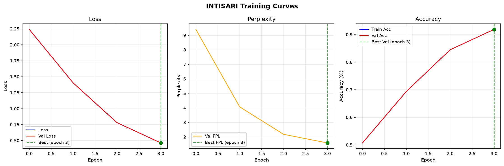
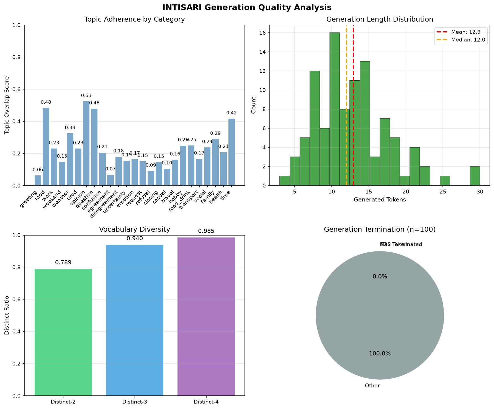
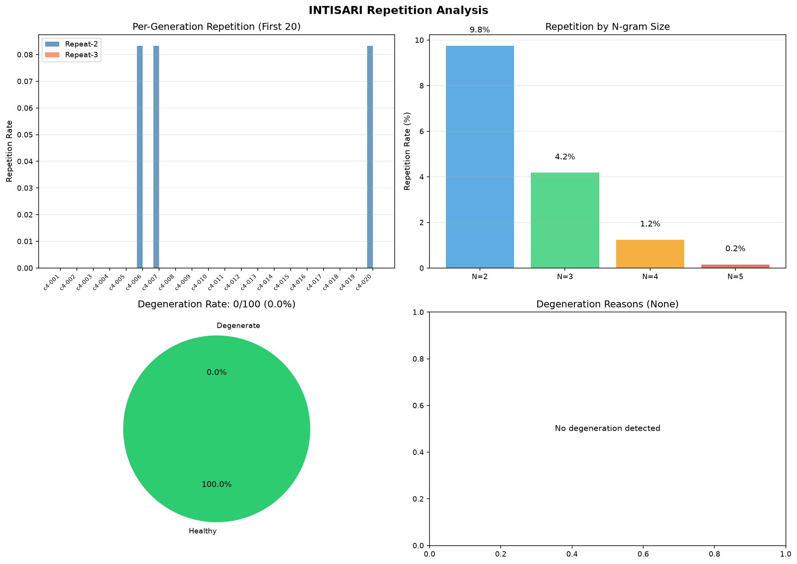

# INTISARI-CHAT-V5

INTISARI-CHAT-V5 adalah LLM (Large Language Model) Bahasa Indonesia berukuran kecil yang dilatih dari awal menggunakan causal language modeling / next-token prediction. Model ini dirancang untuk mempelajari pola bahasa, struktur kalimat, kosakata, dan text continuation dalam Bahasa Indonesia, dengan fokus tambahan pada pola percakapan casual.

Model ini merupakan eksperimen conversational language modeling berukuran kecil, bukan model knowledge-heavy dan bukan model yang dirancang untuk penalaran atau factual question answering.

## Demo

Coba model secara langsung:

**[https://intisari.flatseek.io](https://intisari.flatseek.io)**

---

## Statistik Singkat

| | |
|---|---:|
| Parameters | ~66.2M |
| Reported Parameters | 53.3M* |
| Training Samples | 64,284 |
| Context Length | 512 tokens |
| Epochs | 4 |
| Training Time | ~9.12 hours |
| Training Steps | 15,264 |
| Validation Loss | 0.462 |
| Validation Perplexity | 1.59 |
| Validation Accuracy | 91.9% |
| Samples/sec | 7.4 |
| Tokens/sec | 199.9 |

\* Parameter count pada metadata evaluasi tercatat 53.3M, sementara ukuran arsitektur/checkpoint aktual adalah sekitar 66.2M parameter. Angka 66.2M digunakan sebagai ukuran model aktual.

## Arsitektur Model

```text
vocab_size:      4106
n_layers:        22
hidden_dim:      512
context_length:  512
```

Model menggunakan arsitektur Transformer decoder dengan vocabulary yang relatif kecil dan context length 512 tokens.

Ukuran vocabulary dipilih untuk eksperimen Bahasa Indonesia dengan fokus pada pola percakapan, sehingga model dapat mempelajari token dan pola linguistik yang umum muncul dalam conversational text.

## Training

Model dilatih dari scratch menggunakan Flatbuild pada 64,284 training samples selama 4 epoch.

Validation metrics menunjukkan penurunan loss yang konsisten pada setiap epoch.



| Epoch | Val Loss | PPL | Accuracy |
|---:|---:|---:|---:|
| 1 | 2.241 | 9.40 | 50.7% |
| 2 | 1.403 | 4.07 | 69.4% |
| 3 | 0.780 | 2.18 | 84.5% |
| 4 | 0.462 | 1.59 | 91.9% |

Training menunjukkan peningkatan yang cukup besar selama empat epoch. Perplexity turun dari 9.40 menjadi 1.59, sementara token-level accuracy meningkat dari 50.7% menjadi 91.9%.

Namun, seperti eksperimen INTISARI sebelumnya, token-level metrics tidak dapat digunakan sebagai satu-satunya indikator kualitas percakapan.

---

## Evaluasi Generation

Model dievaluasi menggunakan **100 prompt** dari berbagai kategori percakapan Bahasa Indonesia.

Generation menggunakan sampling:

```text
temperature:     0.7
top_k:           50
top_p:           0.95
max_new_tokens:  80
seed:            42
```

Kategori evaluasi mencakup:

- greeting
- food
- work
- weekend
- weather
- tired
- opinion
- question
- confusion
- agreement
- disagreement
- uncertainty
- emotion
- request
- refusal
- closing
- casual
- travel
- hobby
- food & drink
- transport
- social
- family
- health
- time

### Generation Metrics

| Metric | Result |
|---|---:|
| Prompt Count | 100 |
| Average Generated Tokens | 12.93 |
| Median Generated Tokens | 12 |
| Min Tokens | 3 |
| Max Tokens | 30 |
| EOS Rate | 0% |
| Max Token Rate | 0% |
| Repetition 2-gram | 9.75% |
| Repetition 3-gram | 4.18% |
| Distinct-2 | 78.95% |
| Distinct-3 | 93.96% |
| Degeneration Rate | 0% |
| Average Topic Overlap | 22.42% |
| Topic Drift Rate | 25% |



Evaluasi generation menunjukkan bahwa model sudah mampu menghasilkan respons pendek yang umumnya menyerupai percakapan casual Bahasa Indonesia.

Generation juga relatif pendek. Median generation adalah 12 tokens dan tidak ditemukan kasus generation mencapai batas maksimum 80 tokens.



Repetition 2-gram dan 3-gram masih ditemukan, tetapi evaluasi tidak mendeteksi degeneration/looping berat pada 100 prompt yang diuji.

---

## Observasi

### Yang Sudah Berhasil

- pola percakapan Bahasa Indonesia mulai terbentuk dengan jelas
- respons terhadap greeting sudah dapat dikenali
- pola tanya-jawab sederhana mulai muncul
- model mampu menggunakan gaya informal seperti `gue`, `lo`, `udah`, `nih`, dan `dong`
- respons umumnya pendek dan conversational
- beberapa respons secara natural mengembalikan pertanyaan kepada user
- pola sosial seperti ajakan, persetujuan, ketidaksetujuan, dan closing mulai terlihat
- vocabulary diversity cukup baik untuk ukuran model
- tidak ditemukan degeneration rate pada evaluasi 100 prompt
- repetition masih relatif terkendali dibandingkan eksperimen sebelumnya

### Yang Masih Menjadi Masalah

- semantic consistency masih lemah
- topic drift masih terjadi pada sekitar 25% prompt
- respons kadang berpindah ke topik yang tidak berhubungan
- beberapa respons menghasilkan kalimat malformed atau nonsensical
- model masih sering menggabungkan pola dari contoh percakapan lain
- persona/style belum konsisten antara `aku`, `gue`, dan `saya`
- beberapa jawaban tidak benar-benar menjawab intent dari user
- model belum memiliki kemampuan factual knowledge yang dapat diandalkan
- long-range conversational coherence masih terbatas

---

## Contoh Evaluasi

### Greeting

**Prompt**

```text
<|user|>
Halo
<|assistant|>
```

**Output**

```text
Haha, gue juga rasa lebih baik kita ngobrol santai!
```

Respons sudah mengenali konteks greeting dan menghasilkan ajakan ngobrol, walaupun formulasi kalimat masih belum sepenuhnya natural.

### Simple Question

**Prompt**

```text
<|user|>
Apa kabar?
<|assistant|>
```

**Output**

```text
Aku baik baik, terima kasih.
```

Ini merupakan contoh respons sederhana yang sesuai dengan intent prompt.

### Food

**Prompt**

```text
<|user|>
Udah makan?
<|assistant|>
```

**Output**

```text
Udah. Kamu?
```

Model dapat menghasilkan pola conversational response yang sangat pendek dan natural.

### Weekend

**Prompt**

```text
<|user|>
Weekend mau ngapain?
<|assistant|>
```

**Output**

```text
Gue mau ke pantai, mau berenang dan bermain pasir.
```

Model mampu menghasilkan continuation yang sesuai dengan konteks aktivitas weekend.

### Hobby

**Prompt**

```text
<|user|>
Gue suka main game
<|assistant|>
```

**Output**

```text
Gue juga suka main game, apa game yang kamu suka?
```

Model menunjukkan pola conversational yang baik dengan memberikan respons sekaligus mengembalikan pertanyaan.

### Closing

**Prompt**

```text
<|user|>
Nanti ngobrol lagi ya
<|assistant|>
```

**Output**

```text
Nanti aku siap ngobrol lebih lama
```

Model dapat mengenali pola closing dan memberikan respons yang relevan.

---

## Contoh Failure Cases

Walaupun token-level accuracy mencapai 91.9%, generation masih memperlihatkan keterbatasan yang penting.

### Topic Drift

**Prompt**

```text
<|user|>
Gue dapet promosi
<|assistant|>
```

**Output**

```text
Gue juga pernah merasa sama, kalo gue denger kalo ga, gue langsung ke mall, apa yang gue lakukan untukkan?
```

Respons mempertahankan bentuk conversational, tetapi tidak mempertahankan konteks promosi secara baik.

### Semantic Inconsistency

**Prompt**

```text
<|user|>
Gue lagi sakit
<|assistant|>
```

**Output**

```text
Mungkin karena mereka tidak di latih
```

Model gagal memberikan continuation yang sesuai dengan konteks kesehatan.

### Repetition / Malformed Text

**Prompt**

```text
<|user|>
Beliin gue makan dong
<|assistant|>
```

**Output**

```text
Haha, gue juga suka makan sandwich! Gue suka makan sandwichhdhhon.
```

Pola kalimat masih conversational, tetapi muncul token/substring malformed pada akhir generation.

### Off-topic Response

**Prompt**

```text
<|user|>
Lo suka traveling?
<|assistant|>
```

**Output**

```text
Iya, gue suka banget main game strategi, apa yang paling kamu suka?
```

Respons masih berbentuk percakapan tetapi berpindah dari travel ke gaming.

---

## Base Model dan Conversational Training

INTISARI-CHAT-V5 tetap merupakan model language modeling berukuran kecil yang belajar melalui objective causal language modeling / next-token prediction.

Berbeda dengan base model murni, dataset training V5 difokuskan pada pola percakapan sehingga model belajar distribusi bahasa yang lebih dekat dengan conversational text.

Tujuan eksperimen ini bukan untuk membangun chatbot yang memiliki pengetahuan luas, tetapi untuk menguji seberapa jauh model kecil dapat mempelajari:

- pola dialog
- turn-taking
- respons pendek
- informal Indonesian
- vocabulary conversational
- question-answer patterns
- agreement/disagreement
- emotional responses
- social interaction
- conversational closing

Karena itu, kemampuan knowledge retrieval, factual answering, reasoning, dan long-form generation tidak menjadi target utama model ini.

---

## Keterbatasan

- hanya sekitar 66.2M parameter
- vocabulary relatif kecil: 4,106 tokens
- context length hanya 512 tokens
- training dataset berfokus pada percakapan dasar
- factual knowledge sangat terbatas
- topic drift masih terjadi
- semantic consistency belum stabil
- malformed text masih dapat muncul
- style/persona belum sepenuhnya konsisten
- belum dioptimalkan untuk reasoning
- belum ditujukan untuk knowledge-intensive tasks
- belum dapat dianggap sebagai chatbot production-ready

---

## Apa yang Ditunjukkan Eksperimen Ini

Eksperimen INTISARI-CHAT-V5 mencoba menjawab pertanyaan:

> **Seberapa jauh model Bahasa Indonesia berukuran kecil dapat mempelajari pola percakapan hanya dari training data conversational yang relatif terbatas?**

Hasil training menunjukkan peningkatan yang sangat besar:

- validation loss mencapai **0.462**
- perplexity mencapai **1.59**
- token-level accuracy mencapai **91.9%**
- model menghasilkan respons conversational yang dapat dikenali
- respons pendek dan pola turn-taking mulai terbentuk
- repetition cukup terkendali
- degeneration rate pada evaluasi 100 prompt adalah **0%**
- tetapi topic drift masih terjadi pada **25%** prompt
- semantic consistency masih menjadi keterbatasan utama

Hal yang penting dari eksperimen ini adalah bahwa **akurasi token yang tinggi tidak otomatis berarti kualitas percakapan tinggi**.

Model dapat sangat baik dalam memprediksi token berdasarkan distribusi training data, tetapi masih menghasilkan respons yang tidak menjawab intent, berpindah topik, atau membentuk kalimat yang tidak masuk akal.

---

## Perbandingan Training vs Generation

Training metrics:

```text
Loss       0.462
PPL        1.59
Accuracy   91.9%
```

Generation metrics:

```text
Degeneration Rate   0%
Topic Drift Rate    25%
Distinct-2          78.95%
Distinct-3          93.96%
```

Perbedaan ini menunjukkan bahwa evaluation pada dua level diperlukan:

1. **Token-level evaluation** untuk mengukur kemampuan model mempelajari distribusi training data.
2. **Generation-level evaluation** untuk mengukur apakah kemampuan tersebut menghasilkan bahasa dan percakapan yang masuk akal.

Untuk model conversational kecil, generation-level evaluation menjadi sangat penting.

---

## Penggunaan

```bash
flatbuild generate outputs/intisari-chat-v5/.../checkpoints/final \
  --prompt "<|user|>\nHalo\n<|assistant|>\n" \
  --max-new 80 \
  --temperature 0.7
```

Model menggunakan conversational format:

```text
<|user|>
Pesan user
<|assistant|>
Respons assistant
```

---

## Dataset

Model dilatih menggunakan **64,284 training samples** yang berfokus pada percakapan Bahasa Indonesia.

Dataset dirancang untuk mencakup pola percakapan dasar seperti:

- greeting
- small talk
- food & drink
- work
- weekend
- travel
- hobbies
- weather
- emotions
- opinions
- questions
- requests
- agreement
- disagreement
- uncertainty
- social interaction
- family
- health
- time
- closing

Fokus dataset bukan memberikan knowledge coverage yang luas, melainkan meningkatkan kemampuan model dalam mengenali dan melanjutkan pola percakapan sehari-hari.

---

## Roadmap Eksperimen

Eksperimen berikutnya dapat difokuskan pada:

1. meningkatkan kualitas dan naturalness dataset
2. memperbanyak variasi conversational patterns
3. mengurangi semantic contradiction
4. meningkatkan topic adherence
5. menjaga konsistensi persona/style
6. memperbaiki response relevance
7. menguji multi-turn conversation
8. mengevaluasi hubungan antara ukuran model dan conversational quality

---

## Lisensi

Apache 2.0

---

Dilatih dari scratch menggunakan [Flatbuild](https://github.com/flatseek/flatbuild).
